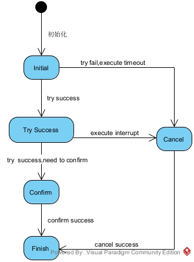

# EasyTransaction
轻量级最大努力重试型TCC 分布式柔性事务解决方案

## 原理
本地事务凭证状态机



## 使用指南
### 引入依赖
```xml
      <dependency>
        <groupId>com.openquartz</groupId>
        <artifactId>easytransaction-spring-boot-starter</artifactId>
        <version>${lastVersion}</version>
      </dependency>
```

### 执行SQL
```sql
CREATE TABLE `et_transaction_certificate_entity`
(
    `id`                 bigint       NOT NULL AUTO_INCREMENT COMMENT 'id',
    `transaction_id`     varchar(50)  NOT NULL DEFAULT '' COMMENT '事务ID',
    `certificate_status` tinyint      NOT NULL DEFAULT '0' COMMENT '凭证状态',
    `created_time`       timestamp    NOT NULL DEFAULT CURRENT_TIMESTAMP COMMENT '创建时间',
    `finished_time`      datetime              DEFAULT NULL COMMENT '完成时间',
    `updated_time`       timestamp    NOT NULL DEFAULT CURRENT_TIMESTAMP ON UPDATE CURRENT_TIMESTAMP COMMENT '创建时间',
    `confirm_method`     varchar(256) NOT NULL DEFAULT '' COMMENT '取消 method',
    `cancel_method`      varchar(256) NOT NULL DEFAULT '' COMMENT '取消 method',
    `retry_count`        int          NOT NULL DEFAULT '0' COMMENT '重试数',
    `version`            int          NOT NULL DEFAULT '0' COMMENT '数据版本',
    PRIMARY KEY (`id`),
    UNIQUE KEY `idx_transaction_id` (`transaction_id`)
) ENGINE=InnoDB DEFAULT CHARSET=utf8mb4 COLLATE=utf8mb4_0900_ai_ci COMMENT='事务凭证';
```

### 使用注解
使用注解在try 方法上,并在相同的类下提供confirm/cancel方法
例如：
```java
  @Override
    @Tcc(confirmMethod = "confirmOrderStatus", cancelMethod = "cancelOrderStatus")
    @Transactional(rollbackFor = Exception.class)
    public void makePayment(Order order) {
        updateOrderStatus(order, OrderStatusEnum.PAYING);
        accountClient.payment(buildAccountDTO(order));
        inventoryClient.decrease(buildInventoryDTO(order));
    }


    @Override
    @Tcc(confirmMethod = "confirmOrderStatusWithNested", cancelMethod = "cancelOrderStatusWithNested")
    @Transactional(rollbackFor = Exception.class)
    public String makePaymentWithNested(Order order) {
        updateOrderStatus(order, OrderStatusEnum.PAYING);
        final BigDecimal balance = accountClient.findByUserId(order.getUserId());
        if (balance.compareTo(order.getTotalAmount()) <= 0) {
            throw new RuntimeException("余额不足！");
        }
        accountClient.paymentWithNested(buildAccountNestedDTO(order));
        return "success";
    }

    @Transactional(rollbackFor = Exception.class)
    public void confirmOrderStatusWithNested(Order order) {
        updateOrderStatus(order, OrderStatusEnum.PAY_SUCCESS);
        accountClient.confirmNested(buildAccountNestedDTO(order));
        inventoryClient.confirm(buildInventoryDTO(order));
        LOGGER.info("=========进行订单confirmNested操作完成================");
    }

    @Transactional(rollbackFor = Exception.class)
    public void cancelOrderStatusWithNested(Order order) {
        updateOrderStatus(order, OrderStatusEnum.PAY_FAIL);
        accountClient.cancelNested(buildAccountNestedDTO(order));
        inventoryClient.cancel(buildInventoryDTO(order));
        LOGGER.info("=========进行订单cancelNested操作完成================");
    }

    @Transactional(rollbackFor = Exception.class)
    public void confirmOrderStatus(Order order) {
        updateOrderStatus(order, OrderStatusEnum.PAY_SUCCESS);
        accountClient.confirm(buildAccountDTO(order));
        inventoryClient.confirm(buildInventoryDTO(order));
        LOGGER.info("=========进行订单confirm操作完成================");
    }

    @Transactional(rollbackFor = Exception.class)
    public void cancelOrderStatus(Order order) {
        updateOrderStatus(order, OrderStatusEnum.PAY_FAIL);
        accountClient.cancel(buildAccountDTO(order));
        inventoryClient.cancel(buildInventoryDTO(order));
        LOGGER.info("=========进行订单cancel操作完成================");
    }
```

## 特性
### 超时&重试
同时注解支持设置事务超时时间设置以及重试设置
```java
/**
 * @author svnee
 */
@Retention(RetentionPolicy.RUNTIME)
@Target(ElementType.METHOD)
public @interface Tcc {

    /**
     * 提交method
     */
    String confirmMethod() default "";

    /**
     * 取消method
     */
    String cancelMethod() default "";

    /**
     * 超时时间,单位：毫秒 默认不超时
     */
    long timeout() default Long.MAX_VALUE;

    /**
     * Try method 重试次数。默认 不重试
     */
    int retryCount() default 0;

    /**
     * 重试时间间隔 单位：毫秒
     */
    long retryInterval() default 0;
}
```

### 扩展异步支持

TCC执行Try 完成后。调用Confirm方法或者Cancel方法可以扩展自定义异步框架驱动或MQ、Job支持等。系统默认支持使用当前线程执行。
如需扩展需要继承接口`java.util.concurrent.Executor`
并注入到Spring工厂中.替换为自定义的实现
```java
    @Bean
    @ConditionalOnMissingBean
    public Executor triggerExecutor() {
        return new DirectExecutor();
    }
```
